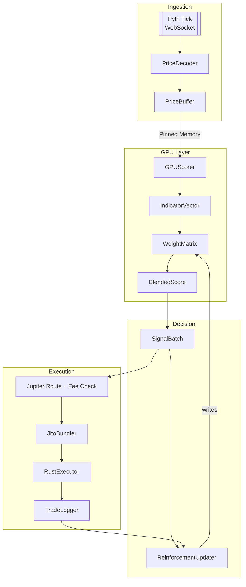

P# Price‑Only TA Stack for Solana Trading Bots

*Rust + CUDA 11.8 — Zero‑Order‑Book, Hyper‑Low‑Latency*

---

## 📖 Project Synopsis

This repository delivers a **fully‑GPU‑accelerated, price‑only technical‑analysis (TA) engine** built in 100 % Rust.  The stack ingests live price ticks straight from **Pyth Network WebSockets**, computes an arsenal of on‑GPU indicators across multiple time frames, and emits actionable buy/sell scores to a Rust execution layer (which can bundle privately via **Jito**, route through **Jupiter**, or swap on any SPL AMM).

Unlike traditional trading bots that depend on order‑book snapshots, on‑chain volume, vault delta logs, or chain‑crawler heuristics, this engine focuses **exclusively on price**.  The design goals are:

* **Simplicity** — fewer data dependencies → fewer failure modes.
* **Speed** — CUDA kernels smash through millions of ΔP/P calculations in micro‑seconds.
* **Adaptivity** — a lightweight reinforcement‑learning loop retunes indicator weights after every trade based on realized PnL.
* **Portability** — compile‑time‑safe Rust on the host; CUDA 11.8 PTX on any Pascal‑or‑newer NVIDIA card.

> **TL;DR:** Point a WebSocket at Pyth, ship ticks to the GPU, spit out scores.  No Python, no external key, no order‑book—just pure latency‑minimized TA.

---

## ✨ Key Features & Advantages

| Feature                           | Why It Matters                                                                                     | Impact                                                                    |
| --------------------------------- | -------------------------------------------------------------------------------------------------- | ------------------------------------------------------------------------- |
| **Price‑Only Data Path**          | Strips away noisy volume & spoofed depth—perfect for launch‑day meme coins where L2 is unreliable. | Cleaner signals & less MEV bait.                                          |
| **GPU‑Native Indicators**         | CUDA 11.8 kernels written in C++17 and loaded via `cust`.                                          | Millions of ops per tick with <10 µs latency on an RTX 40.                |
| **Multi‑Time‑Frame Blending**     | 1 m (entry), 5 m (trend), 15 m (macro) evaluated independently & combined.                         | Eliminates single‑frame whipsaws; reacts quickly yet respects macro bias. |
| **Reinforcement‑Learned Weights** | TD‑λ style reward: `ΔPnL / risk` → adjust weight matrix.                                           | Auto‑tunes to each token’s micro‑structure over the first 50–100 trades.  |
| **Rust Host + CUDA Kernels**      | No GIL, no Python packaging hell.                                                                  | Cross‑compile on Windows & Linux; predictable binaries.                   |
| **Plug‑and‑Play Route Safety**    | Jupiter quote inspection + Jito bundles + Light Protocol fallback.                                 | Safer fills, lower front‑run risk, optional privacy.                      |

---

## 🔍 Why *Price‑Only* vs. Order Book?

| Aspect                       | Price‑Only (This Repo)           | Order‑Book Strategies                       |
| ---------------------------- | -------------------------------- | ------------------------------------------- |
| **Data Requirements**        | 1× Pyth tick feed                | L2 + L3 subscriptions, reserve change logs  |
| **Latency Path**             | WS → GPU (<1 ms)                 | WS → CPU diff → book construction (5–20 ms) |
| **Robustness on Rug Tokens** | High (price always exists)       | Low (fake depth, missing fills)             |
| **Predictive Horizon**       | Short‑to‑medium (trend/momentum) | Ultra‑short (order‑flow micro‑alpha)        |
| **Build Complexity**         | Low                              | + AMM math, CLOB parsing, queue decoding    |

> Use price‑only as **signal generator** and optional order‑book depth for **execution sizing** if you trade blue‑chips—best of both worlds.

---

## ⚛️ System Architecture (Deep Dive)



### Module Glossary

* **PriceDecoder** — parses raw Pyth WS messages into `[u64 slot, f64 price]` tuples.
* **PriceBuffer** — lock‑free ring buffer (`crossbeam::ArrayQueue`) shared with GPU.
* **GPUScorer** — launches kernels to compute indicator vectors in parallel.
* **WeightMatrix** — `[frame][indicator] → f32` matrix stored in device memory; updated by host via CUDA unified memory.
* **SignalBatch** — structure containing final scores, confidence, and stop distances.
* **RouteSelector** — queries Jupiter `/quote` with notional, parses `priceImpactPct`, `liquidityFee`.
* **JitoBundler** — wraps signed TX(s) into a bundle JSON and posts to `https://jito.block-engine.solana.com`.

---

## ⌚ Time‑Frame Logic

Each time frame maintains its own **circular tick window** of *N* observations:

```text
N1 = 120 ticks (≈ 60 s)
N2 = 600 ticks (≈ 5 m)
N3 = 1 800 ticks (≈ 15 m)
```

Indicators read directly from device memory—zero host round‑trips.  Final signal is:

```math
score = Σ_i w_i · z_i
```

Where `w_i` = weight, `z_i` = z‑scored indicator.  The macro (15 m) score inverts 1 m/5 m long signals when negative.

---

## ⚖️ Indicator Details

| Indicator               | CUDA Kernel                 | Equation / Notes                                                                        |    |                                          |
| ----------------------- | --------------------------- | --------------------------------------------------------------------------------------- | -- | ---------------------------------------- |
| **Momentum**            | `delta_price<<<grid,blk>>>` | `(P_t − P_{t‑k}) / P_{t‑k}`                                                             |    |                                          |
| **Hilbert Cycle**       | `hilbert_phase<<<…>>>`      | Extract analytic signal via discrete Hilbert transform; output phase angle φ ∈ \[−π,π]. |    |                                          |
| **Fractal ATR**         | `fatr<<<…>>>`               | Hurst‑adaptive ATR: \`ATR = α·                                                          | ΔP | + (1−α)·ATR\_{t‑1}\` where α = f(Hurst). |
| **FAMA Gap**            | `fama_gap<<<…>>>`           | `(P − FAMA) / ATR`, FAMA = Fractal Adaptive Moving Average.                             |    |                                          |
| **Permutation Entropy** | `perm_entropy<<<…>>>`       | Shannon entropy of ordinal patterns length = 5.                                         |    |                                          |
| **FFT Band Power**      | `fft_power<<<…>>>`          | Power spectral density over band 0.04–0.10 Hz.                                          |    |                                          |

---

## 🎛️ Weight‑Matrix Evolution

Reinforcement update rule (simplified):

```math
w_{t+1} ← w_t + η · (PnL_norm) ·  z
```

* `η` — learning rate (default 0.002).
* `PnL_norm` — normalized by notional & volatility.
* `z` — current indicator z‑score.

Weights are clipped to ±1 to prevent blow‑ups, then renormalized per frame.

---

## 🖥️ Hardware & Software Matrix

### Minimum GPU Requirements

* **Pascal (sm\_60)** — GTX 10‑series; \~250 µs full pipeline latency.
* **Turing (sm\_75)** — RTX 20/30; \~110 µs.
* **Ada (sm\_89)** — RTX 40; sub‑60 µs.

### Tested OS / Toolchains

| OS                  | NVIDIA Driver | CUDA | Rustc       | Notes                        |
| ------------------- | ------------- | ---- | ----------- | ---------------------------- |
| **Windows 11 22H2** | 555.45        | 11.8 | 1.79‑stable | VS 2022 Build Tools required |
| **Ubuntu 24.04**    | 555.42        | 11.8 | 1.79‑stable | GCC 13 & `build‑essential`   |

> 🐧 **Linux users:** run `./scripts/install_cuda_11_8.sh` for automated toolkit + driver install.

---

## ⚡ Quick‑Start

### Windows (PowerShell Short‑Form)

```powershell
winget install -e --id Nvidia.CUDA.11.8
winget install Microsoft.VisualStudio.2022.BuildTools -s winget
irm https://sh.rustup.rs | iex
rustup default stable

# Clone & build
 git clone https://github.com/your‑org/price‑only‑ta‑rust.git
 cd price‑only‑ta‑rust
 cargo run --release -- --config configs/main.toml
```

### Linux (One‑Liner)

```bash
curl -sL https://raw.githubusercontent.com/your‑org/price‑only‑ta‑rust/main/scripts/install.sh | bash
```

The script installs driver 555, CUDA 11.8, Rustup, pulls the repo, and launches.

---

## 📂 Repository Layout (Expanded)

```
├─ ci/                 # GitHub Actions & Azure Pipelines
├─ docs/               # Extended markdown docs & diagrams
│  └─ migration-12.md  # CUDA 12.x notes
├─ examples/           # Example configs & weight‑matrix snapshots
├─ benches/            # Criterion benchmarks for kernels
└─ tests/              # Integration tests (cargo test)
```

---

## 🔧 Extending the Engine

1. **Add a new indicator**

   * Write CUDA kernel to `src/gpu/`.
   * Append to `IndicatorId` enum in `src/score.rs`.
   * Register in `launch_kernels()`.
2. **Plug a new route source** (e.g., Orca RFQ)

   * Implement `RouteProvider` trait; return quote struct w/ `priceImpactPct`.
3. **Persist RL weights**

   * Toggle `--persist-weight` to save `sled` DB every 60 s.

---

## 🛠️ Troubleshooting & FAQ (Extended)

| Issue                              | Possible Cause                  | Fix                                                         |
| ---------------------------------- | ------------------------------- | ----------------------------------------------------------- |
| *Kernel launch failure*            | Mismatched `sm_XX` vs. GPU arch | Re‑compile PTX with correct `-arch` flag.                   |
| `cust::error::CudaError::NoDevice` | CUDA runtime can’t see GPU      | Check driver install; verify Secure Boot off on Windows.    |
| **Zero trades executed**           | Score never passes threshold    | Lower `--score‑cutoff`, inspect logs, check Pyth price IDs. |
| **Inaccurate PnL logs**            | Wrong decimals for mint         | Update token decimals in `configs/tokens.toml`.             |

---

## 🗺️ Roadmap

* **CUDA 12.x** migration branch (Q3 2025).
* **Metal/WGPU backend** for Apple‑Silicon GPUs (Q4 2025).
* **On‑chain weight sync** via Solana PDA for distributed bots.
* **Grafana dashboard** exporter (Prometheus metrics).
* **Plugin API** so third‑party indicators can hot‑load as PTX without recompiling host.

---

# 🛡️ Solana Safety‑Checked Execution Layer

A companion crate `safety‑exec` guards each swap against common **rug vectors** and execution pitfalls.

## Rug‑Vector Checklist

| Problem                                   | Rust Defence                                                                                                                    | Reference        |
| ----------------------------------------- | ------------------------------------------------------------------------------------------------------------------------------- | ---------------- |
| **Transfer‑Fee / Blacklist (Token‑2022)** | Parse mint extensions via `spl_token_2022`; abort if `TransferFeeConfig`, `PermanentDelegate`, or `DefaultAccountState` ≠ Init. | Solana docs      |
| **Un‑renounced Mint/Frozen**              | `getAccountInfo` → ensure `mint_authority`, `freeze_authority` = `None`.                                                        | SPL spec         |
| **Spoofed Metadata**                      | Jupiter **strict list** `https://token.jup.ag/strict`.                                                                          | Jupiter forums   |
| **Phishing Pools**                        | Allow only program IDs: Raydium AMM v4/CLMM, Orca Whirlpool, Phoenix, Meteora.                                                  | Hard‑coded table |
| **Wallet Blacklist Honeypot**             | Rotate fresh `Keypair::new()` per trade.                                                                                        | Dev‑to blog      |
| **Liquidity Rug**                         | Reject TVL < 0.5 SOL / 500 USDC; re‑query reserves until sell.                                                                  | Internal         |
| **Price Spoof vs Pyth**                   | Abort if pool price diverges > 5 % from Pyth.                                                                                   | Pyth docs        |
| **Hidden Tax**                            | `simulateTransaction` for 1 unit; block if effective out < 85 %.                                                                | RPC guide        |

## Execution Flow

```text
Signal → Jupiter quote → Safety checks →
  pass → sign TX → Jito bundle → RPC
  fail → discard & log reason
```

---

## 📚 Further Reading

* **Jupiter Aggregator** — [https://docs.jup.ag/](https://docs.jup.ag/)
* **Jito Labs** — [https://docs.jito.network/](https://docs.jito.network/)
* **Light Protocol** — [https://docs.lightprotocol.com/](https://docs.lightprotocol.com/)
* **Pyth Network** — [https://docs.pyth.network/](https://docs.pyth.network/)
* **Phoenix Order Book** — [https://github.com/ellipsislabs/phoenix-v1](https://github.com/ellipsislabs/phoenix-v1)

---

## 🤝 Contributing

1. Fork → Feature branch → Pull request.
2. Run `cargo fmt && cargo clippy -- -D warnings`.
3. New CUDA kernels must include Criterion bench.

   Sign PRs with DCO.

---

##
